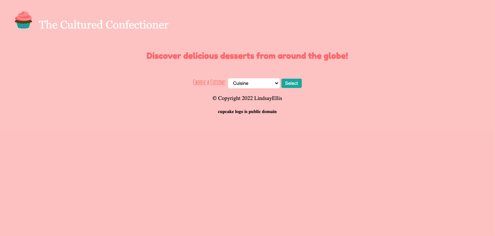
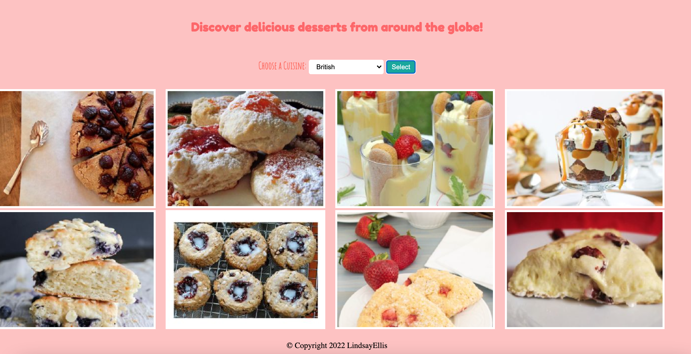
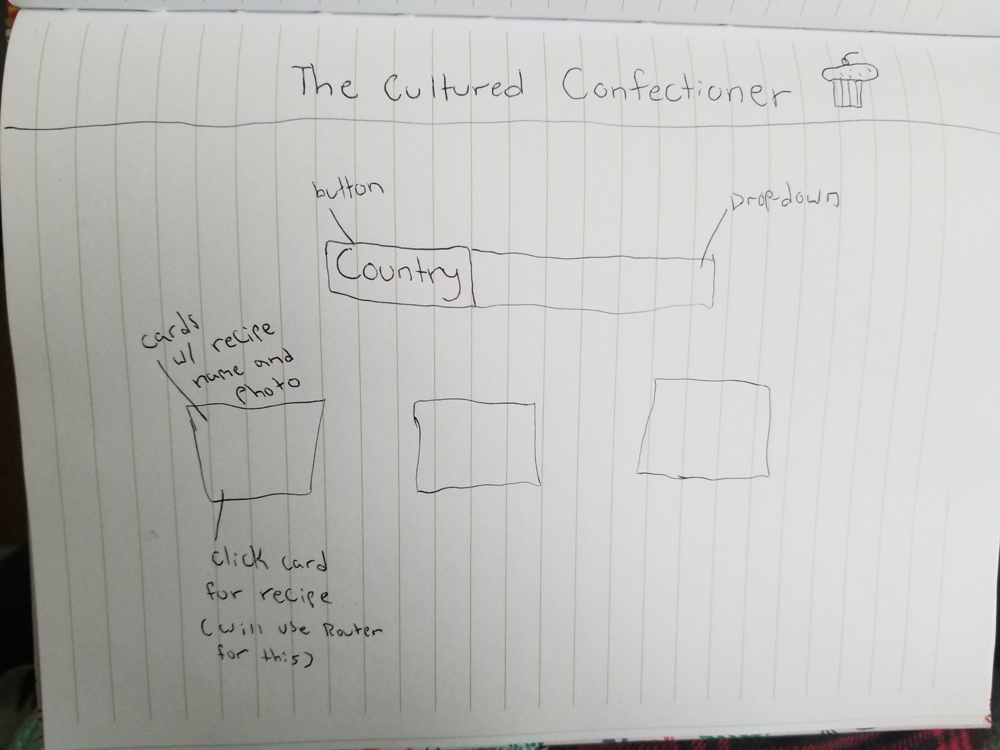

## The Cultured Confectioner

The Cultured Confectioner is a React app that makes it easy for users to explore different dessert recipes from around the world and experience the food of different cultures.

## App Screenshots

## Technologies Used

1. React
2. CSS
3. JavaScript
4. Netlify

## Wireframe

## Unsolved Problems

I really didn't get to do any of my stretch goals, the CSS took me longer than I expected. It was also difficult to work on my project at the beginning of the week since my power was out, but that's something that is completely out of the ordinary.